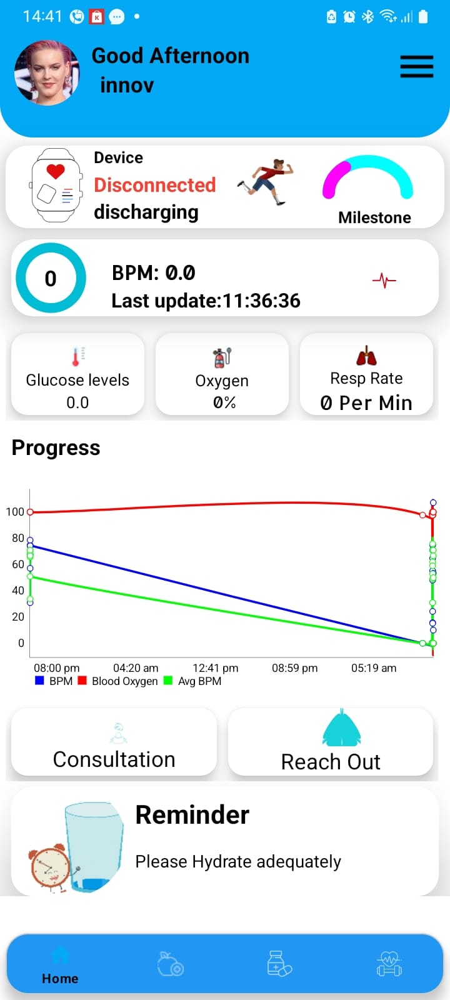
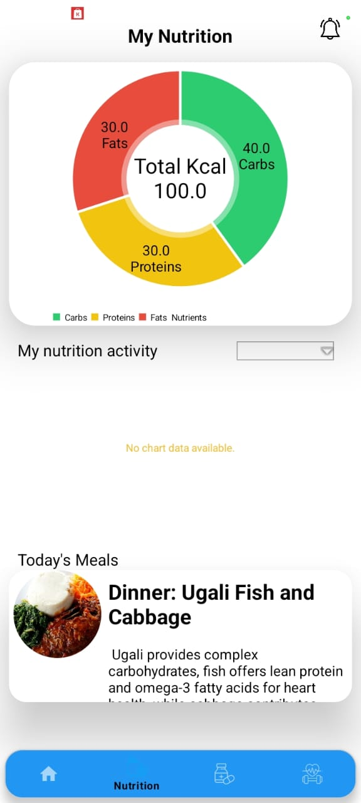
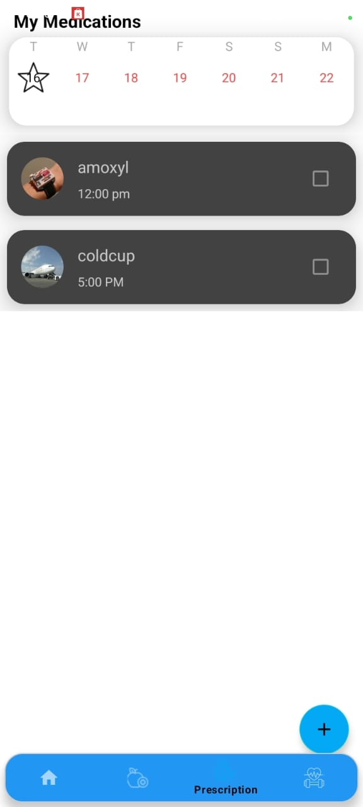
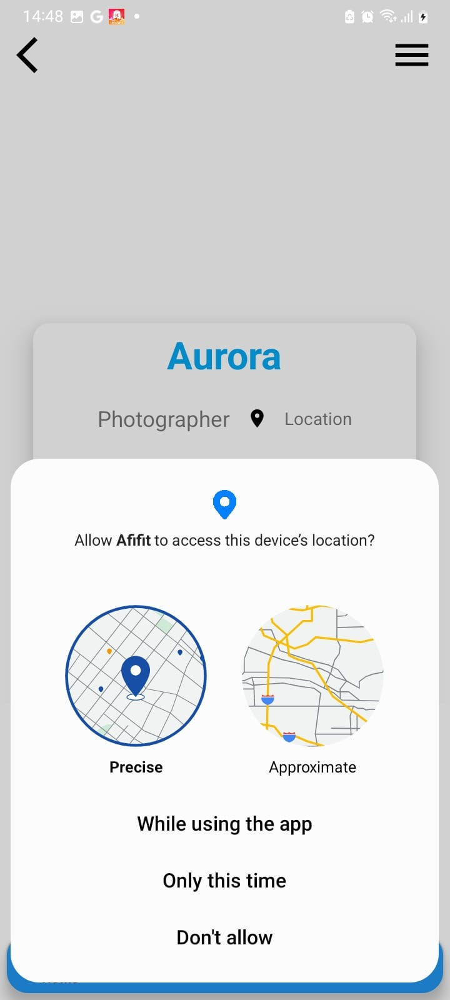
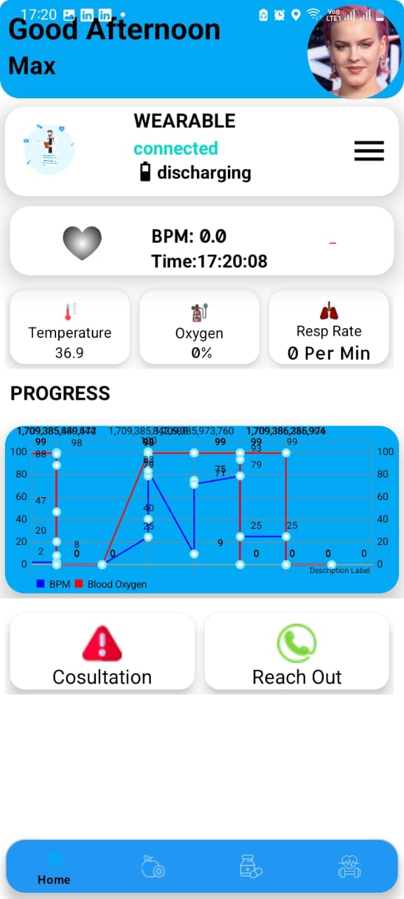
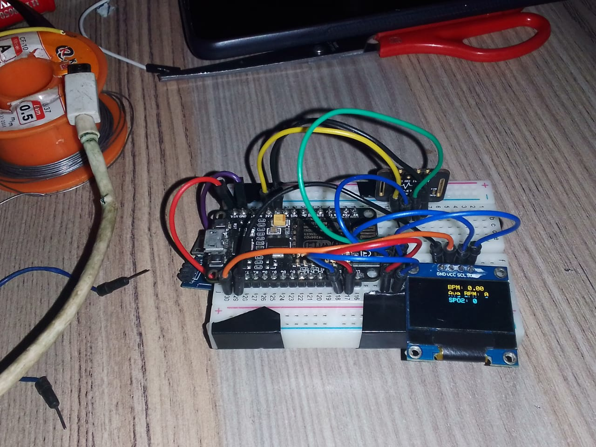

# Afifit - Android App for Health Monitoring with NodeMCU and Firebase Integration

## Overview

Afifit is a comprehensive health monitoring solution that combines a custom Android app developed in Kotlin with hardware integration using NodeMCU. The app reads health readings from the NodeMCU hardware and securely pushes the data to Firebase for real-time monitoring. The integration also utilizes the AMQP (Advanced Message Queuing Protocol) for efficient communication between the Android app and the hardware.

## Features

- **Android App**: A user-friendly mobile application built with Kotlin for seamless health monitoring.
- **NodeMCU Hardware**: The hardware component responsible for collecting health data and facilitating communication with the app.
- **Firebase Integration**: Securely store and retrieve health readings on Firebase for easy access and real-time tracking.
- **AMQP Protocol**: Efficient communication protocol for data exchange between the Android app and NodeMCU hardware.

## Getting Started

### Prerequisites

- Android Studio for app development.
- NodeMCU hardware configured with necessary health monitoring sensors.
- Firebase account for data storage and retrieval.
- AMQP server for communication between the app and hardware.

### Installation

1. Clone the repository:

    ```bash
    git clone https://github.com/innov-max/afifit.git
    ```

2. Open the Android project in Android Studio and build the app.

3. Configure NodeMCU hardware with necessary sensors and ensure AMQP server connectivity.

4. Set up Firebase and update the Firebase configuration in the app.

## Screenshots

<div align="center">
  
  
  
</div>

<div align="center">
  
  
</div>
##Demo Video

[)](https://youtu.be/8DCyiNHlaGk)

Click on the image above to watch the demo video.

## License

This project is licensed under the [MIT License](LICENSE.md).

## Acknowledgments

- Special thanks to [contributors](CONTRIBUTORS.md) who participated in this project.
- Inspired by the need for an integrated health monitoring solution using modern technologies.

## Contributing

Please read [CONTRIBUTING.md](CONTRIBUTING.md) for details on our code of conduct, and the process for submitting pull requests to us.

## Issues and Support

If you encounter any issues or have questions, please open an issue in the [issue tracker](https://github.com/innov-max/afifit/issues).

